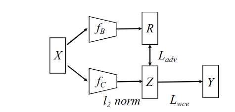
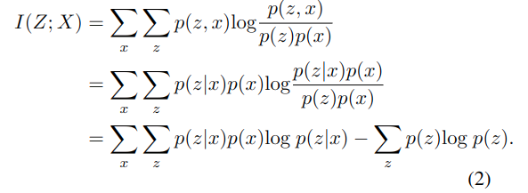
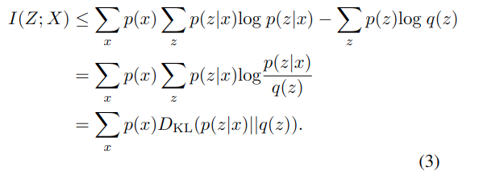
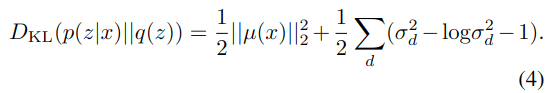
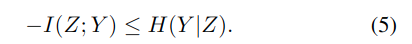
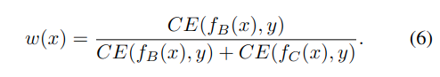
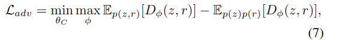
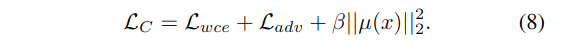
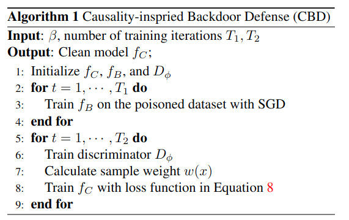

#! https://zhuanlan.zhihu.com/p/668781921
## 通过重表征学习来进行后门防御(CVPR2023)
## 题目:Backdoor Defense via Deconfounded Representation Learning  
后门攻击的定义：后门攻击者将后门触发器(Backdoor trigger)附加到一些良性数据中，并且把他们的标签更改为攻击者指定的目标标签。在训练期间，神经网络学习触发器和目标标签之间的相关性，在推理过程中，后门模型在良性数据上表现正常，而当后门触发器被激活的时候，模型的预测会被恶意改变。  

本文的任务：专注于图像分类任务，旨在在没有额外干净数据的情况下在中毒数据集上训练无后门模型。
我们首先构建一个因果图来模拟后门数据的生成过程，其中考虑了干扰因素（即后门触发器模式）。在因果图的帮助下，我们发现后门攻击充当混淆器，并在输入图像和预测标签之间打开虚假路径（图 1）。如果 DNN 学习了这种虚假路径的相关性，则在附加触发器时，它们的预测将更改为目标标签。  
  

本文的方法：在 CBD 中，训练了两个DNN，它们分别关注虚假相关性和因果效应。第一个DNN旨在有意捕获与早期停止策略的后门相关性。然后通过最小化互信息来训练另一个干净的模型独立于隐藏空间中的第一个模型。 

在本文中，我们提出的CBD与基于毒性抑制的防御最为相关。我们的目标是直接在有毒的数据集上训练干净的模型，而不需要访问干净的数据集或进一步改变训练好的模型。与ABL不同的是，CBD直接在有毒数据集上训练干净模型，而无需进一步对训练模型进行微调(去学习后门)。与DBD相比，CBD不需要额外的自我监督预训练阶段，而且效率更高。  

假设攻击者已经生成了一组后门示例，并已成功应用于训练数据集。我们还假设防御者对训练过程完全控制，但不知道给定数据集中后门示例的分布或比例。防御者的目标是在中毒数据集上训练无后门模型，这与在纯干净数据上训练的模型一样好。  

人类执行因果推理的能力可以说是将人类学习与深度学习区分开来的最重要特征之一。DNN 通常无法区分因果关系和统计关联，并且倾向于学习与所需知识“更容易”的相关性 [16, 46]。这种捷径解决方案可能会导致对干扰因素（例如触发模式）的过度拟合，这将进一步导致后门攻击的脆弱性。因此，在这里我们利用因果推理来分析 DNN 模型训练并减轻后门注入的风险。  
因果图是形式化因果推理的关键。一种方法是使用因果结构学习来推断因果图[50]，但将这种方法应用于像图像这样的高维数据是具有挑战性的。在这里，继之前的工作 [49,70, 71] 之后，我们利用领域知识（图1(a)）来构建因果图 G（图1(b)）来模拟中毒数据的生成过程。  

由于混淆变量 B 在我们的设置中很难检测和测量，我们可以简单地使用后门调整来阻止后门路径。相反，由于大多数深度学习模型的目标是为下游任务学习准确的嵌入表示 [1, 20, 26, 66]，我们的目标是解开隐藏空间中的混淆效应和因果效应。  

## 具体方法  
在实践中，可能很难直接识别数据空间中X的混杂因素和因果因素。  
我们假设在隐藏的表征中，混杂因素和因果因素会被反映出来。  
  
我们训练的DNN包括$f_B$和$f_C$，它们分别关注了虚假相关关系和因果关系。  
我们取$f_B$和$f_C$的倒数第二层的嵌入向量为R和Z。注意，这里引入R是为了避免与B混淆。  
为了避免混淆，我们在本文中使用大写字母表示变量，小写字母表示具体值。  

为了生成捕获因果关系的高质量变量Z，我们从解纠缠表示学习中获得灵感[20,66]。在训练阶段，$f_B$首先在中毒数据集上进行训练，以捕获后门的虚假相关性。然后我们训练另一个干净的模型$f_C$，以鼓励在隐藏空间中的独立性。$Z⊥R$具有互信息最小化和样本重加权。训练完成后，下游分类任务只使用$f_C$。在本节的其余部分，我们将详细介绍CBD的每个步骤。  

### 训练后门模型$f_B$  
我们训练$f_B$以寻找Trigger-Backdoor之间的伪相关关系。由于中毒数据仍然包含因果关系，我们有意通过提前停止策略加强$f_B$中的混杂偏差。具体来说，我们只训练$f_B$几个epoch(例如5个epoch)，并将其参数冻结在$f_C$的训练中。这是因为先前的研究表明，后门关联比因果关系更容易学习[32]。附录B的实验也验证了后门样例上的损失接近0，而$f_B$在5次epoch后仍然没有收敛到干净样例上。   

### 训练后门模型$f_C$  
受前人[19,26]的启发，我们制定了信息瓶颈和相互信息最小化的$f_C$ 训练目标:  
$$L_C = min  \beta I(Z;X)-I(Z;Y) + I(Z;R) \tag{1}$$  
函数$I()$表示互信息函数。  
第1项和第2项构成信息瓶颈损失[61]，促使变量Z在约束不相关信息(第1项)的同时捕获核心信息进行标签预测(第2项)。  
β是一个权重超参数。第3项是去混杂惩罚项，描述了后门嵌入与去混杂嵌入Z之间的依赖程度。它通过最小化相互信息来鼓励Z独立于R，从而关注因果效应。然而，损失$L_C$并不是直接可处理的，特别是对于去混杂惩罚项。在实践中，我们松弛了方程1，优化了第1项和第2项的上界以及第3项的估计。详情如下所示:  

#### 第1项$I(Z;X)$  
  
但是因为边际概率$p(z) = \sum_xp(z|x)p(x)$难以计算，所以我们用我们用变分近似来解决这个问题，我们使用变分分布q(z)来近似p(z)。通过$Gibbs$不等式，我们知道KL散度是非负的，即：  
$$D_{KL}(p(z)||q(z)) \ge 0 \rightarrow -\sum_zp(z)log p(z) \le -\sum_zp(z)logq(z)$$
带入公式2,则有:  
   
假设后验概率$p(z|x) = N(\mu(x),diag\{\sigma^2(x)\})$,先验 q(z) 被假定为标准高斯分布,最后，我们可以将上述上限重写为：  
  

#### 第2项$I(Z;Y)$  
我们有 I(Z; Y ) = H(Y )− H(Y |Z)，其中 H(·) 和 H(·|·) 分别表示熵和条件熵。由于 H(Y ) 是一个正常数并且可以忽略，我们有以下不等式:  
  

在实验中，H(Y |Z) 可以计算为交叉熵损失 (CE)。为了进一步鼓励 $f_C$ 和 $f_B$ 之间的独立性，我们固定 $f_B$ 的参数并使用样本加权交叉熵损失 (Lwce) 训练 $f_C$。权重计算为:  
  

#### 第3项$I(Z;R)$    

$$I(Z;R) = D_{KL} (p(Z,R)||p(Z)p(R))$$
为了最小化去混杂惩罚项I(Z;R)，我们建议使用最小化联合分布p(Z, R)和边缘p(Z)p(R)之间的距离的对抗过程。  

训练鉴别器D将从p(Z, R)中提取的采样分类为真，即1；从边缘p(Z)p(R)中提取的样本作为假，即0。通过对p(Z, R)训练批中的样本(z, r)的单个表示进行洗牌，得到边际分布p(Z)p(R)中的样本。  

  

所以网络$f_C$的目标函数为：  
  

此外，鼓励 Z 和 R 之间的独立性可能会导致 fC 的预测信息的丢失。然而，在精心设计的优化目标和训练方案下，CBD 设法在保持因果关系的同时尽可能地减少混淆效应。以下部分显示了详细的验证。  
